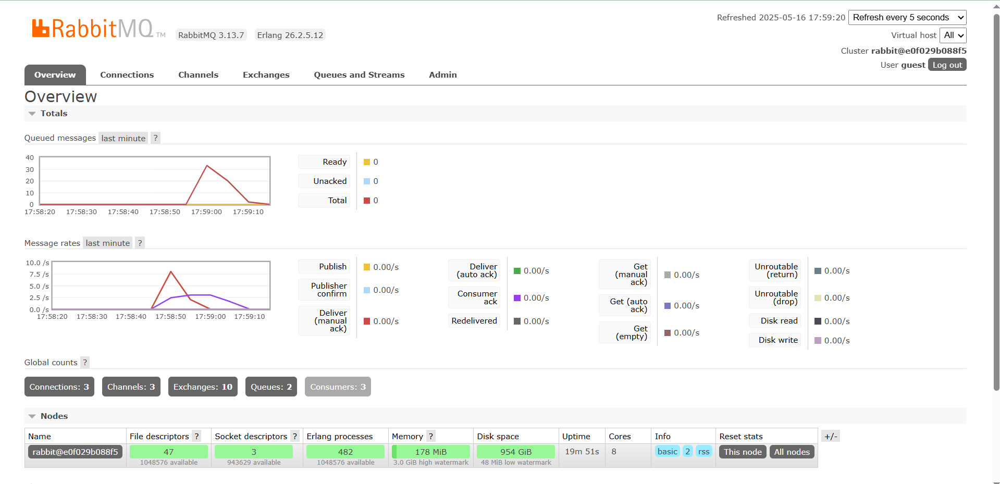

a. AMQP stands for Advanced Message Queuing Protocol. It's a protocol used for sending messages between systems, commonly used with message brokers like RabbitMQ.

b. In guest:guest@localhost:5672:

- The first "guest" is the username.

- The second "guest" is the password.

- localhost:5672 means you're connecting to a server running on your own machine (localhost) using port 5672, which is the default port for AMQP.

## RABBITMQ  SIMULATION SLOW SUBSCRIBER

When the subscriber is deliberately slowed down by adding a one-second delay per message, the producer continues sending messages quickly. This causes the messages to pile up in the queue since they’re arriving faster than the subscriber can process them, which results in a noticeable increase in the queue length on the RabbitMQ dashboard.

## Multiple Subscriber

When multiple subscriber instances are active, the messages from the publisher are shared across them, enabling parallel processing. This helps clear the queue more quickly, which can be seen as a faster decrease in the queued message count on the RabbitMQ dashboard.